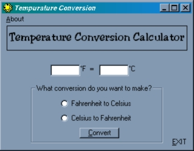



## Temperature Conversion

### Description

converts fahrenheit to celsius, and vice versa. this is 1.5 I made a mathmatical error in 1.0, and added msgbox()'s if you don't select a checkbox or enter a temperature. download and try it out. then vote
 
### More Info
 

             |
---                |---
**Submitted On**   |2000-10-08 00:26:18
**By**             |[Joe Shmoe](https://github.com/Planet-Source-Code/PSCIndex/blob/master/ByAuthor/joe-shmoe.md)
**Level**          |Beginner
**User Rating**    |3.8 (30 globes from 8 users)
**Compatibility**  |VB 3\.0, VB 4\.0 \(16\-bit\), VB 4\.0 \(32\-bit\), VB 5\.0, VB 6\.0
**Category**       |[Math/ Dates](https://github.com/Planet-Source-Code/PSCIndex/blob/master/ByCategory/math-dates__1-37.md)
**World**          |[Visual Basic](https://github.com/Planet-Source-Code/PSCIndex/blob/master/ByWorld/visual-basic.md)
**Archive File**   |[CODE\_UPLOAD104911082000\.zip](https://github.com/Planet-Source-Code/joe-shmoe-temperature-conversion__1-11921/archive/master.zip)

